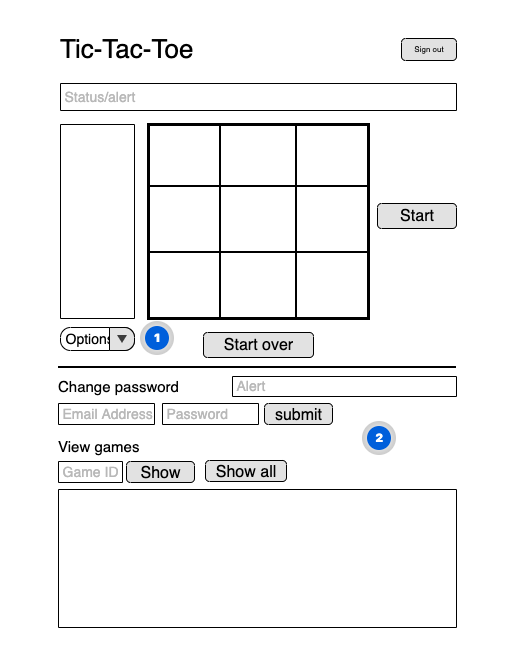

README

# Tic-Tac-Toe
Game Board                                 | Account
:-----------------------------------------:|:---------------------------------:
|

### User stories
* User should be able to sign up, sign in, sign out, change password.
* User should be able to start over in the middle of the game.
* User should be able to restart a game when a game is over.
* User should be able to pull up a game record with ID#, and all the game records.
* User should be able to see if there's any error.
* User should be able to play on mobile device.

### TODOS
* Easy mode AI
* Multiplayer feature using multiple devices.

### technologies used
* HTML
* Sass
* Bootstrap
* JavaScript
* jQuery
* Ajax

### Working on this first project

It was great opportunity to get used to coding and JavaScript. I had lots of fun digging through online resources and working with colleagues to come up with a solution when I'm stuck. I learned simple data structure of a single page application running on JavaScript, and how to interact with a RESTful API using Ajax. Writing simple game logic was also very fun too. It was very interesting to see how other people came up with different solutions for the it.

### Wireframe

### Links
* [Wireframe](https://app.moqups.com/pZIClmFr9I/view)
* [Deployed App](https://wyang19a.github.io/tic-tac-toe-client)
